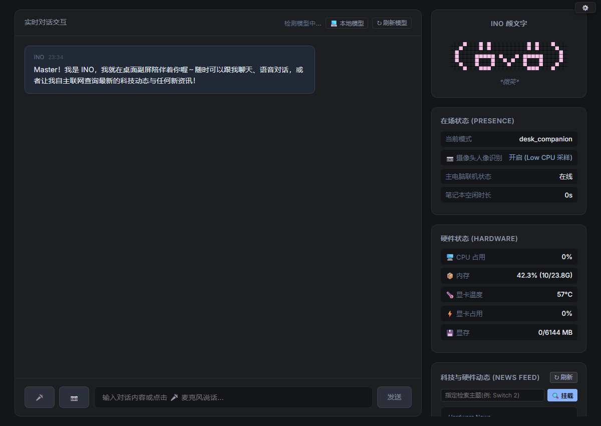

<div align="center">

# INO Accompany

### 基于 VOICEVOX 的中日双语语音输出伴侣

<p align="center">
  
</p>

[](https://www.python.org/)
[](https://github.com/)
[](LICENSE)
[](https://github.com/)

> 提示：本项目代码架构与跨平台工程由 Google DeepMind Antigravity 辅助生成与重构。

[部署指南](DEPLOY_GUIDE.md) · [发布说明](GITHUB_UPLOAD_GUIDE.md) · [问题反馈](.github/ISSUE_TEMPLATE/bug_report.md)

</div>

---

## 🎙️ 核心亮点：VOICEVOX 中日双语语音输出算法

本项目核心围绕 **VOICEVOX 引擎** 实现了低延迟、防爆音、高质量的中日双语语音输出方案：

### 1. 中文拼音拟音算法 (`zh` 模式)
- **跨语种音素对齐**：针对 VOICEVOX 原生仅支持日语音素的限制，通过拼音（声母、韵母、声调）与片假名（Katakana）音素的声学特征映射，实现中文汉字到日文假名发音串的精确转换。
- **二次元声线直接说中文**：无需重新训练模型，即可直接使用 VOICEVOX 的数十款二次元角色音色（如九州Sora、四国めたん、冥鸣Himari等）开口朗读中文。

### 2. 日文异步流式合成与防爆音管线 (`ja` 模式)
- **短句切片与预取流水线 (Prefetch Pipeline)**：根据标点智能切分长句，第一句快速合成并秒级播放，后台并发异步预取后续分块，大幅降低首字延迟，实现长文本流畅朗读。
- **常驻音频流播放器 (`StreamingAudioPlayer`)**：基于 `sounddevice` 实现常驻音频流，避免频繁启停系统音频设备导致的“咔嗒”杂音；并在缓冲用尽时提供 5ms 欠载平滑淡出，彻底消除切句爆音问题。

---

## 🛠️ 辅助功能

- **Web CRT 交互界面**：32×32 点阵颜文字显示与对话面板，支持在网页端即时切换音色、调节语速与音量。
- **大模型接口支持**：兼容本地 LM Studio / Ollama（OpenAI 兼容格式）及云端 API（如 DeepSeek）。
- **轻量在位感知**：Win32/macOS 键鼠在位检测与全屏免打扰（全屏应用或观影时自动静默）。

---

## 🚀 快速启动

### 🪟 Windows
1. 双击运行 **`setup_windows.bat`** 安装依赖；
2. 双击运行 **`start_ino.bat`** 启动应用（静默常驻可运行 `start_ino_silent.vbs`）；
3. 打开浏览器访问：`http://localhost:5000`。

### 🍎 macOS
```bash
bash setup_mac.sh    # 一键部署
./start_ino_mac.sh   # 启动
```

---

## ⚙️ 核心配置 (`config.yaml`)

```yaml
voice:
  engine_dir: voicevox_engine  # VOICEVOX 目录
  speaker_id: 16               # 音色 ID (16: 九州Sora)
  voice_lang_mode: ja          # 语音模式: ja (日文原生) 或 zh (中文拟音)
  speed_scale: 1.0             # 语速
  volume: 0.8                  # 音量

llm:
  base_url: http://127.0.0.1:1234/v1 # 本地 LM Studio / Ollama 地址
```

---

## 📜 开源协议

- 本项目基于 [MIT License](LICENSE) 开源。
- VOICEVOX 声音模型版权归其各自作者与 VOICEVOX 官方所有，使用需遵循各角色的使用规约。
